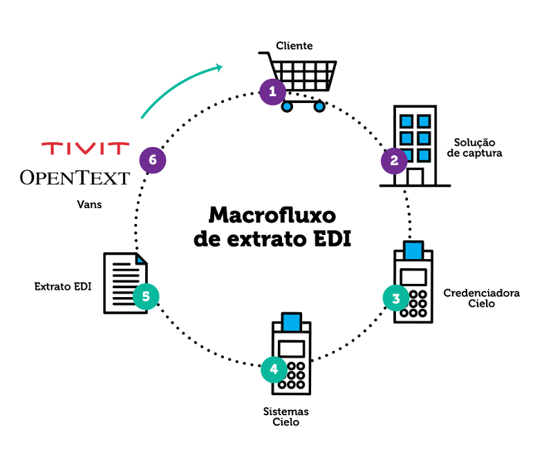

# Introdução

O Extrato Eletrônico (EDI) é um  produto disponibilizado pela Cielo aos clientes que necessitam de automatização no processo de conciliação. Nele, as informações são transmitidas de forma padronizada sem intervenção manual por meio do canal EDI, proporcionando agilidade e segurança no tráfego das informações.

## Benefícios

* Permite a realização da conciliação contábil e financeira de forma automatizada;
* Maior agilidade e eficiência operacional;
* Integração com a automação comercial de vendas;
* Segurança no recebimento das informações;
* Atendimento especializado.

## Atendimento

### Ilha EDI – Atendimento especializado

* (11) 4002 5270 - capitais, regiões metropolitanas e demais localidades
* edi@cielo.com.br
* De segunda a sexta-feira, das 9 às 18 horas.

# Tipos de extrato EDI

É possível solicitar o recebimento dos seguintes tipos de arquivos de Extrato Eletrônico:

|Tipo de arquivo|Informação|Tipo de registro|Conciliação|
|---------------|----------|----------------|-----------|
|03 - Vendas com Plano Parcelado|<ul><li>Vendas concluídas (apresentadas) no dia anterior, ajustes e transações rejeitadas, com a previsão de pagamento.</li><li>Todo o plano parcelado da venda realizada no dia anterior.</ul> <strong>Obs.:</strong> a previsão de pagamento é enviada somente para a primeira parcela. Caso seja alterada por ajustes, os registros de aceleração e reagendamento das parcelas envolvidas serão apresentados.|<ul><li>0 - Header</li><li>1 - Detalhe RO (com a primeira parcela)</li><li>2 - Detalhe CV</li><li>1 - Detalhe RO (previsão da segunda parcela em diante)</li><li>9 – Trailer</li></ul>|Conferir se todas as vendas realizadas foram recebidas pela Cielo.|
|04 - Pagamentos|<ul><li>Valores pagos na conta-corrente no dia do envio do Extrato: detalha os ROs e ajustes  compensados no dia.</li><li>Transações compensadas, já antecipadas ou cedidas anteriormente e pagamentos de parcelas em aberto.</li></ul>|<ul><li>0 - Header</li><li>1 - Detalhe RO</li><li>2 - Detalhe CV</li><li>9 – Trailer</li></ul>|Conferir origem do pagamento recebido (tipo de venda, bandeira e cliente/estabelecimento que efetuou a venda). Conciliação com a conta-corrente.|
|06 - (1) Antecipação de Recebíveis|Operação de ARV realizada pela Cielo no dia anterior ao envio do arquivo e respectivo detalhe dos ROs e CVs que foram antecipados.|<ul><li>0 - Header</li><li>5 - Detalhe de ARV</li><li>6 - Detalhe ROs antecipados</li><li>2 - Detalhe CV </li><li>7 - Detalhe de débitos de ROs Antecipados</li><li>2 - Detalhe CV </li><li>9 – Trailer</li></ul> <strong>Obs.:</strong> Será demonstrado o registro tipo 5 para cada operação realizada por domicílio bancário.|Atualizar o fluxo de caixa, considerando os valores já recebidos através da antecipação.|
| 07 - Cessão de Recebíveis|<ul><li>Operação de cessão realizada no banco domicílio (Bradesco ou HSBC) no dia anterior ao envio do arquivo e respectivo detalhe dos ROs cedidos.</li><li>Não é demonstrada a condição comercial negociada ou parcela cedida.</li></ul>|<ul><li>0 - Header</li><li>5 - Detalhe de cessão de recebíveis</li><li>6 - Detalhe ROs cedidos</li><li>9 – Trailer</li></ul> <strong>Obs.:</strong> Será demonstrado o registro tipo 5 para cada operação realizada por domicílio bancário.|Atualizar o fluxo de caixa, considerando os valores já recebidos através da operação de cessão.|
| 08 - Parcelas Pendentes|Arquivo gerado uma única vez no primeiro dia após o cliente optar pelo recebimento do extrato de Vendas com Plano Parcelado (arquivo 03).|<ul><li>0 - Header</li><li>1 - Detalhe RO</li><li>2 - Detalhe CV</li><li>9 – Trailer</li></ul>|Elaborar a previsão de fluxo de caixa das vendas realizadas anteriormente.|
|09 - Saldo em Aberto|<ul><li>Valores a receber com a Cielo, contemplando as transações realizadas, capturadas e processadas, vendas a débito, crédito e parceladas ainda não liquidadas no movimento fechado no mês anterior.</li><li>É apresentado um indicador de ARV e Cessão, para facilitar a conciliação dos ROs envolvidos nas operações de antecipação e que alteram os valores em aberto do cliente.</li><li>O arquivo é disponibilizado mensalmente.</li></ul>|<ul><li>0 - Header</li><li>1 - Detalhe RO</li><li>9 - Trailer</li></ul>|Atualizar a previsão futura de recebimentos com os devidos abatimentos de Antecipações, Cessões e Ajustes.|

# Layouts dos Tipos de Registros

As informações demonstradas no Extrato Eletrônico (EDI) serão organizadas pelos tipos de registros que estão descritos na sequência.

## Tipo 0 - Header

Identifica o cabeçalho de cada arquivo por cadeia de extrato eletrônico*.

|Início|Fim|Tamanho|Tipo|Descrição|Edição dos dados|
|------|---|-------|----|---------|----------------|
|001|001|1|Num.|Tipo de registro|Constante “0”: identifica o tipo de registro header (início do arquivo).|
|002|011|10|Num.|Estabelecimento Matriz|Número do estabelecimento matriz da cadeia de extrato eletrônico.|
|012|019|8|Num.|Data de processamento|AAAAMMDD – data em que o arquivo foi gerado.|
|020|027|8|Num.|Período inicial|AAAAMMDD – menor data de captura encontrada no movimento.|
|028|035|8|Num.|Período final|AAAAMMDD – maior data de captura encontrada no movimento.|
|036|042|7|Num.|Sequência|Número sequencial do arquivo. Nos casos de recuperação este dado será enviado como 9999999.|
|043|047|5|Alfa.|Empresa adquirente|Constante Cielo.|
|048|049|2|Num.|Opção de extrato|Vide Tabela I.|
|050|050|1|Alfa|VAN|“I” – OpenText (antiga GXS), “P” – TIVIT.|
|051|070|20|AlfaNum.|Caixa Postal|Informação obtida no formulário de cadastro na VAN|
|071|073|3|Num|Versão Layout|Constante “001”.|
|074|250|177|AlfaNum|Uso Cielo|Em Branco. Reservado para Cielo.|

* (1) Cadastro que permite a inclusão de todos os estabelecimentos controlados pelo cliente, independentemente do pagamento ser centralizado. Todos os *números de estabelecimento* devem ser informados no formulário de cadastro.

## Tipo 1 - Detalhe do Resumo de Operações (RO)

Grupo de vendas, ajustes ou cobrança de serviços. Permite identificar a origem dos lançamentos e as ações de manutenção.

|Início|Fim|Tamanho|Tipo|Descrição|Edição dos dados|
|------|---|-------|----|---------|----------------|
|001|001|1|Num.|Tipo de registro|Constante “1” - Identifica o tipo de registro detalhe do RO.|
|002|011|10|Num.|Estabelecimento Submissor|Número do estabelecimento e/ou filial onde a venda foi realizada.|
|012|018|7|Num.|Número do RO|Número do resumo de operação. Contêm informações referentes a um grupo de vendas realizadas em uma determinada data.|
|019|020|2|Num.|Parcela|No caso de venda parcelada, será formatado com o número da parcela que está sendo liberada na data do envio do arquivo. No caso de venda à vista, será formatado com brancos.|
|021|021|1|Alfa|Filler|<ul><li>“/” – Para vendas parceladas.</li><li>“a” – aceleração das parcelas.</li><li>“  “ – demais situações.</li></ul>|
|022|023|2|AlfaNum.|Plano|No caso de venda parcelada, será formatado com o maior número de parcelas encontradas naquele grupo de vendas. Se o RO tiver vendas em 03, 04 ou 06 parcelas, será preenchido com 06. Se for uma aceleração de parcelas, será formatado com a maior parcela acelerada.  Exemplo: (posições 019 a 023) <ul><li>02A02 – indica a aceleração da parcela 02 até a 02, ou seja, somente uma parcela.</li><li>03A08 – indica a aceleração da parcela 03 até a parcela 08 do plano da venda, ou seja, foram aceleradas 06 parcelas.</li></ul> No caso de venda à vista, será formatado com brancos.|
|024|025|2|Num.|Tipo de Transação|Código que identifica a transação – vide Tabela II. Preenchido com 00 no Extrato de Saldo Aberto (09) para o "Saldo Parcelado"|
|026|031|6|Num.|Data de apresentação|AAMMDD – Data em que o RO foi transmitido para a Cielo.|
|032|037|6|Num.|Data prevista de pagamento|AAMMDD – Data prevista de pagamento. Na recuperação, pode ser atualizada após o processamento da transação ou ajuste.|
|038|043|6|Num.|Data de envio para o banco(5)|AAMMDD – Data em que o arquivo de pagamento foi enviado ao banco. Na recuperação, pode ser atualizada após o processamento da transação ou ajuste.|
|044|044|1|Alfa|Sinal valor bruto|<ul><li>“+” identifica valor a crédito.</li><li>“-” identifica valor a débito.</li></ul>|
|045|057|13|Num.|Valor bruto (1)|Somatória dos valores de venda.|
|058|058|1|Alfa|Sinal da comissão(5)|<ul><li>“+” identifica valor a crédito.</li><li>“-” identifica valor a débito.</li></ul>|
|059|071|13|Num.|Valor da comissão (1) (5)|Valor da comissão descontada sobre as vendas.|
|072|072|1|Alfa.|Sinal do valor rejeitado(4)|<ul><li>“+” identifica valor a crédito.</li><li>“-” identifica valor a débito.</li></ul>|
|073|085|13|Num.|Valor rejeitado (1) (4)|Se houver rejeição, será preenchido com a somatória das transações rejeitadas.|
|086|086|1|Alfa|Sinal do valor líquido|<ul><li>“+” identifica valor a crédito.</li><li>“-” identifica valor a débito.</li></ul>|
|087|099|13|Num.|Valor líquido (1)|Valor das vendas descontado o valor da comissão.|
|100|103|4|Num.|Banco|Código do banco no qual os valores foram depositados|
|104|108|5|Num.|Agência (5)|Código da agência na qual os valores foram depositados|
|109|122|14|AlfaNum.|Conta-corrente (5)|Código da conta-corrente na qual os valores foram depositados|
|123|124|2|Num.|Status do pagamento|Identifica a situação em que se encontram os créditos enviados ao banco – vide Tabela III. Na recuperação, o status é atualizado de acordo com o envio e retorno de confirmação de pagamento por parte do banco.|
|125|130|6|Num.|Quantidade de CVs aceitos|Quantidades de vendas aceitas no RO.|
|131|132|2|Num.|Código do Produto *(Desconsiderar)*|A partir de 01/03/2014, o Identificador do produto passa a ser enviado nas posições 233-235 com três caracteres. Desconsidere a informação enviada nesta posição.|
|133|138|6|Num.|Quantidades de CVs rejeitados (5)|Quantidade de vendas rejeitadas no RO.|
|139|139|1|Alfa|Identificador de revenda/aceleração (5)|Identifica as ocorrências de manutenção em transações parceladas na loja:<ul><li>“R” - Revenda</li><li>“A” - Aceleração</li><li>“  “ – Brancos (nenhuma ocorrência)</li></ul>|
|140|145|6|Num.|Data da captura de transação (5)|AAMMDD - Data em que a transação foi capturada da pela Cielo. Na recuperação, pode ser atualizada após o processamento da transação ou ajuste.|
|146|147|2|Alfanum|Origem do ajuste (4)|Identifica o tipo de ajuste – vide Tabela V. Preenchido se o tipo de transação for:<ul><li>02 – Ajuste crédito</li><li>03 – Ajuste débito</li><li>04 – Ajuste aluguel</li></ul>|
|148|160|13|Num.|Valor complementar (5)|Valor do saque quando o produto for igual a “36” ou valor do Agro Electron para transações dos produtos “22”, “23” ou “25” apresentados na Tabela IV.|
|161|161|1|Alfa|Identificador de Antecipação|Identificador de antecipação do RO:<ul><li>“  “ – Não antecipado;</li><li>“A” – Antecipado na Cielo – ARV;</li><li>“C” – Antecipado no banco – Cessão de Recebíveis.</li></ul>|
|162|170|9|Num.|Número da operação de Antecipação|Identifica o número da operação de Antecipação apresentada no registro tipo 5 – campo 12 ao 20, associada ao RO antecipado/cedido na Cielo ou no banco. Conterá zeros caso o RO não tenha sido antecipado.|
|171|171|1|Alfa|Sinal do valor Bruto antecipado|<ul><li>“+” identifica valor a crédito.</li><li>“-” identifica valor a débito.</li></ul>|
|172|184|13|Num.|Valor Bruto Antecipado (1)|Valor bruto antecipado, fornecido quando o RO for antecipado/cedido. Será preenchido com zeros quando não houver antecipação. O valor bruto antecipado corresponde ao valor líquido do RO.|
|185|187|3|Num.|Bandeira|Código da Bandeira – vide tabela VI.|
|188|209|22|Num.|Número Único do RO |Número Único de identificação do RO formatado da seguinte forma:<ul><li>Primeira parte (fixa) – 15 posições fixas: identifica o resumo mantendo o seu histórico na Cielo;</li><li>Segunda parte (variável) – 07 posições variáveis: Identifica as alterações realizadas no RO.</li></ul>|
|210|213|4|Num.|Taxa de Comissão (1) (5)|Percentual de comissão aplicado no valor da transação.|
|214|218|5|Num.|Tarifa (1) (2) (5)|Tarifa cobrada por transação.|
|219|222|4|Num.|Taxa de Garantia (1) (2) (5)|Percentual de desconto aplicado sobre transações Electron Pré-Datado.|
|223|224|2|Num.|Meio de Captura (5)|Vide tabela VII. Caso a venda tenha sido reprocessada, o sistema enviará o meio de captura 06: Meio de captura manual; neste caso desconsiderar o valor informado no número lógico do terminal. Campo não disponível para vendas a débito no arquivo de pagamento diário e segunda parcela em diante das vendas parceladas no arquivo de pagamento diário e recuperado.|
|225|232|8|Num.|Número lógico do terminal (5)|Número lógico do terminal onde foi efetuada a venda. Quando o meio de captura for igual a 06, desconsiderar o número lógico do terminal, pois este será um número interno da Cielo.|
|233|235|3|Num.|Código do Produto|Código que identifica o produto – vide Tabela IV. |
|236|245|10|Num.|Matriz de Pagamento (3)|Estabelecimento matriz da cadeia centralizada de pagamento.|
|246|250|5|Alfanum.|Uso Cielo|Em Branco. Reservado para Cielo.|

* (1) - Devem ser consideradas 2 casas decimais, sem vírgulas, pontos, ou qualquer outro caractere.
* (2) - Disponível somente nos arquivos diários; não é demonstrado na recuperação.
* (3) - Disponível somente no extrato de Saldo em Aberto. Para os demais extratos será preenchido com espaços em branco.
* (4) - Campo não informado no extrato de Saldo em Aberto - Rotativo e Parcelado.
* (5) - Campo não informado no extrato de Saldo em Aberto - Parcelado.

## Tipo 2 - Detalhe do Comprovante de Venda (CV)

Detalhe das vendas ou ajustes agrupados em um RO.
Conforme regras de segurança, todos os registros que possuírem número de cartão apresentarão o número truncado.

|Início|Fim|Tamanho|Tipo|Descrição|Edição dos dados|
|------|---|-------|----|---------|----------------|
|001| 001| 1| Num.| Tipo de registro| Constante “2” – identifica o tipo de registro de detalhe do Comprovante de Venda (CV).|
|002| 011| 10| Num.| Estabelecimento Submissor| Número do estabelecimento e/ou filial onde a venda foi realizada.|
|012| 018| 7| Num.| Número do RO| Número do resumo de operação. Contêm informações referentes a um grupo de vendas realizadas em uma determinada data.|
|019| 037| 19| Alfanum|Número do cartão truncado| Número do cartão truncado: número do cartão que efetuou a compra com número truncado. Conterá zeros para compras via mobile payment ou comércio eletrônico, sendo para o último opcional.|
|038| 045| 8| Num.| Data da venda/ajuste| AAAAMMDD – Data em que a venda ou o ajuste foi realizado.|
|046| 046| 1| Alfa| Sinal do valor da compra ou valor da parcela| <ul><li>“+” identifica valor a crédito.</li><li>“-” identifica valor a débito.</li></ul>|
|047| 059| 13| Num.| Valor da compra ou valor da parcela (1) |Valor da compra ou da parcela que foi liberada, no caso de venda parcelada na loja.|
|060| 061| 2| Num.| Parcela| No caso de venda parcelada, será formatado com o número da parcela que está sendo liberada. No caso de venda à vista, será formatado com zeros.|
|062| 063| 2| Num.|Total de parcelas|Número total de parcelas da venda. No caso de venda à vista, será formatado com zero.|
|064| 066| 3| Num.| Motivo da rejeição| Vide Tabela VIII, caso não possua rejeição o campo é formatado em branco.|
|067|072|6|Alfanum|Código de autorização|Código de autorização da transação. Este número não é único e pode se repetir. Para efeito de conciliação deverá ser combinado com outras chaves.|
|073|092|20|Alfanum|TID|Identificação da transação realizada no comércio eletrônico ou mobile payment.|
|093|098|6|Alfanum|NSU/DOC|Número sequencial, também conhecido como DOC (número do documento), que identifica a transação no dia em que ela foi realizada. Este número não é único e pode se repetir. Caso a venda tenha sido reprocessada, o NSU pode ser alterado.|
|099|111|13|Num|Valor Complementar (1)|Valor da transação de Saque com cartão de Débito ou AgroElectron de acordo com indicador de produto do RO.|
|112|113|02|Num|Dig - Cartão|Número de Dígitos do Cartão|
|114|126|13|Num|Valor total da venda no caso de Parcelado Loja (2)|O valor total da venda parcelada na loja é enviado somente no arquivo de vendas em todas as parcelas. Para os demais casos estará vazio.|
|127|139|13|Num|Valor da próxima parcela (2)|O valor das próximas parcelas da venda é enviado somente no arquivo de vendas. Para clientes sem plano parcelado, será enviado em todas as parcelas da venda, com exceção da última parcela. Para clientes com plano parcelado será enviado na primeira parcela capturada e no detalhe da primeira parcela acelerada.|
|140|148|9|Num|Número da Nota Fiscal (2)|Número da nota fiscal para estabelecimentos que capturam esta informação no POS. Quando não disponível será formatado com zeros|
|149| 152| 4| Num.| Indicador de cartão emitido no exterior (2)|Identifica se o cartão que realizou a compra foi emitido no exterior conforme abaixo:<ul><li>“0000” - Serviço não atribuído</li><li>“0001” - Cartão emitido no Brasil</li><li>“0002” - Cartão emitido no exterior</li></ul>|
|153| 160| 8| Num.| Número lógico do terminal| Número lógico do terminal onde foi efetuada a venda. Quando o Meio de Captura for 06, desconsiderar esta informação.|
|161|162|2|Alfa|Identificador de taxa de embarque ou valor de entrada|Identificação da transação referente à taxa de embarque ou valor de entrada:<ul><li>TX - Taxa de embarque;</li><li>VE - Valor da entrada;</li><li>Brancos - para demais tipos de transação.</li></ul>|
|163|182|20|Alfanum|Referência/código do pedido|Referência ou código do pedido informado em uma transação mobile payment e comércio eletrônico. Quando não disponível, será formatado com brancos.|
|183|188|6|Num|Hora da transação (2)|Hora da transação apresentada no formado HHMMSS. Essa informação será gerada somente nos registros de venda do arquivo de venda com CV original. Nos demais casos, o campo será formatado com zeros.|
|189|217|29|Num.|Número único da transação|Número Único que identifica cada transação|
|218|218|1|Alfa|Indicador Cielo Promo|Identificador do Produto Cielo Promo = “S”. Identifica que a venda participou de campanha na Plataforma Promocional. Caso contrário, será formatado com brancos.|
|219|250|32|Alfanum|Uso Cielo|Em Branco. Reservado para Cielo.|

* (1) - Devem ser consideradas 2 casas decimais, sem vírgulas, pontos ou qualquer outro caractere.
* (2) - Disponível somente noas arquivos diários; não é demonstrado na recuperação.

## Tipo 5 - Detalhe da Operação de Antecipação de Recebíveis

Apresenta a operação de antecipação realizada na Cielo ou de cessão de recebíveis (para bancos Bradesco e HSBC) realizada no dia anterior à geração do arquivo.

|Início|Fim|Tamanho|Tipo|Descrição|Edição dos dados|
|------|---|-------|----|---------|----------------|
|001| 001| 1| Num.| Tipo de registro| Constante “5” – identifica o tipo de registro que apresenta as informações de uma operação de antecipação.|
|002| 011| 10| Num.| Estabelecimento de pagamento ou submissão| Número do estabelecimento.|
|012| 020| 9| Num.| Número da operação de Antecipação| Número da operação de Antecipação, também apresentado no registro tipo 1 na data de liquidação do RO.|
|021| 028| 8| Num.| Data de crédito da operação |AAAAMMDD – Data de pagamento da operação.|
|029| 029| 1| Alfa| Sinal do valor bruto da antecipação à vista|<ul><li>“+” identifica valor a crédito.</li><li>“-” identifica valor a débito.</li></ul>|
|030| 042| 13| Num.| Valor bruto da antecipação à vista| Valor bruto da antecipação de agenda à vista. O valor bruto da antecipação corresponde à soma dos valores lîquidos originais dos ROs antecipados dessa agenda.|
|043| 043| 1| Alfa| Sinal do valor bruto da antecipação parcelado|<ul><li>“+” identifica valor a crédito.</li><li>“-” identifica valor a débito.</li></ul>|
|044| 056| 13| Num.| Valor bruto da antecipação parcelado |Valor bruto da antecipação da agenda do parcelado. O valor da antecipação corresponde à soma dos valores líquidos originais dos ROs antecipados dessa agenda.|
|057| 057| 1| Alfa| Sinal do valor bruto da antecipação Eléctron Pré-Datado|<ul><li>“+” identifica valor a crédito.</li><li>“-” identifica valor a débito.</li></ul>|
|058| 070| 13| Num.| Valor bruto da antecipação Eléctron Pré-Datado| Valor bruto da antecipação da agenda do Electron Pré-Datado. O valor bruto da antecipação corresponde à soma dos valores líquidos originais dos ROs antecipados dessa agenda.|
|071|071|1|Alfa|Sinal do valor bruto da antecipação total|<ul><li>“+” identifica valor a crédito.</li><li>“-” identifica valor a débito.</li></ul>|
|072|084|13|Num|Valor bruto da antecipação total|Valor bruto da antecipação das agendas à vista, parcelado e Electron Pré-Datado. O valor bruto da antecipação corresponde à soma dos valores líquidos originais dos ROs antecipados.|
|085|085|1|Alfa|Sinal do valor líquido da antecipação à vista|<ul><li>“+” identifica valor a crédito.</li><li>“-” identifica valor a débito.</li></ul>|
|086|098|13|Num|Valor líquido da antecipação à vista|Valor líquido da antecipação da agenda à vista.|
|099|099|1|Alfa|Sinal do valor líquido da antecipação parcelado|<ul><li>“+” identifica valor a crédito.</li><li>“-” identifica valor a débito.</li></ul>|
|100|112|13|Num|Valor líquido da antecipação parcelado|Valor líquido da antecipação da agenda do parcelado.|
|113|113|1|Alfa|Sinal do valor líquido da antecipação Pré-Datado|<ul><li>“+” identifica valor a crédito.</li><li>“-” identifica valor a débito.</li></ul>|
|114|126|13|Num|Valor líquido da antecipação Pré-Datado|Valor líquido da antecipação da agenda do Electron Pré-Datado.|
|127|127|1|Alfa|Sinal do valor líquido da antecipação total|<ul><li>“+” identifica valor a crédito.</li><li>“-” identifica valor a débito.</li></ul>|
|128|140|13|Num|Valor líquido da antecipação total|Valor líquido da antecipação das agendas à vista, parcelado e Electron Pré-Datado.|
|141|145|5|Num|Taxa de desconto da antecipação|Taxa de desconto comercial da antecipação.|
|146|149|4|Num|Banco|Banco no qual os valores foram depositados|
|150|154|5|Num|Agência|Agência na qual os valores foram depositados|
|155|168|14|Alfanum|Conta-corrente|Conta-corrente na qual os valores foram depositados|
|169|169|1|Alfa|Sinal do valor líquido da antecipação|<ul><li>“+” identifica valor a crédito.</li><li>“-” identifica valor a débito.</li></ul>|
|170|182|13|Num|Valor líquido da antecipação|Valor líquido da antecipação.|
|183|250|68|Alfanum|Uso Cielo|Em Branco. Reservado para Cielo.|

## Tipo 6 - Detalhe dos ROs Antecipados

Apresenta o detalhamento da operação de Antecipação demonstrando os Ros antecipados/cedidos.

|Início|Fim|Tamanho|Tipo|Descrição|Edição dos dados|
|------|---|-------|----|---------|----------------|
|001|001|1|Num.|Tipo de registro|Constante “6” – identifica o tipo de registro que apresenta as informações  de um RO que foi antecipado.|
|002|011|10|Num.|Estabelecimento Submissor|Número do estabelecimento e/ou filial onde a venda foi realizada.|
|012|020|9|Num.|Número da operação de antecipação|Número de operação de antecipação.|
|021|028|8|Num.|Data de vencimento do RO|AAAAAMMDD – Data de vencimento original do RO que foi antecipado.|
|029|035|7|Num.|Número do RO antecipado|Número do RO antecipado.|
|036|037|2|Num.|Parcela antecipada|Número da parcela antecipada no caso de RO parcelado, se RO de venda  à vista será formatado com zeros.|
|038|039|2|Num.|Total de parcelas|Quantidade de parcelas do RO. No caso de RO de venda à vista, será formatado com zeros.|
|040|040|1|Alfa|Sinal do valor bruto original do RO|“+” identifica valor positivo. “-” identifica valor negativo.|
|041|053|13|Num.|Valor bruto original do RO (1)|Valor bruto original do RO.|
|054|054|1|Alfa|Sinal do valor líquido original do RO|“+” identifica valor positivo. “-” identifica valor negativo.|
|055|067|13|Num.|Valor líquido original do RO (1)|Valor líquido Original do RO.|
|068|068|1|Num.|Sinal do valor bruto da  antecipação do RO|“+” identifica valor positivo. “-” identifica valor negativo.|
|069|081|13|Num.|Valor bruto da antecipação do RO (1)|Valor líquido original do RO, exceto se houver débitos programados para este RO.|
|082|082|1|Alfa|Sinal do valor líquido da  antecipação do RO|“+” identifica valor positivo. “-” identifica valor negativo.|
|083|095|13|Num.|Valor líquido da antecipação do RO (1)|Valor líquido efetivamente pago ao estabelecimento, já descontada  a taxa de desconto comercial da antecipação.|
|096|098|3|Num.|Bandeira|Código da Bandeira – Vide Tabela VI.|
|099|120|22|Num.|Número Único do RO|Número Único de identificação do RO formatado da seguinte forma: Primeira parte (fixa) - 15 posições fixas: identifica o resumo mantendo o seu histórico na Cielo; Segunda parte (variável) - 07 posições variáveis: para uso da Cielo.  Identifica as alterações realizadas no RO.|
|121|250|130|Alfanum.|Uso Cielo|Reservado para Cielo.|

* (1) - Devem ser consideradas 2 casas decimais, sem vírgulas, pontos ou qualquer outro caractere.

## Tipo 7 - Detalhe dos Débitos de ROs Antecipados

Apresenta os débitos compensados nas datas antecipadas.

|Início|Fim|Tamanho|Tipo|Descrição|Edição dos dados|
|------|---|-------|----|---------|----------------|
|001|001|1|Num.|Tipo de registro|Constante “7” – identifica o tipo de registro que apresenta as informações de um RO que foi antecipado.|
|002|011|10|Num.|Estabelecimento Submissor|Número do estabelecimento e/ou filial onde a venda foi realizada.|
|012|033|22|Num.|Número Único do RO original da venda|Número único do RO original da venda.|
|034|040|7|Num.|Número do RO antecipado|Número do RO da venda original.|
|041|048|8|Num.|Data de pagamento do RO antecipado|AAAAMMDD – Data de Pagamento do RO Antecipado.|
|049|049|1|Alfa|Sinal do valor do RO antecipado|“+” identifica valor positivo. “-” identifica valor negativo.|
|050|062|13|Num.|Valor do RO antecipado|Valor do RO antecipado.|
|063|084|22|Num.|Nº Único do RO da venda que originou o ajuste|Número único do RO da venda que originou o ajuste.|
|085|091|7|Num.|Nº do RO de ajuste a débito|Número do RO que apresenta os valores retidos para a operação de antecipação.|
|092|099|8|Num.|Data de pagamento do ajuste|AAAAMMDD.|
|100|100|1|Alfa|Sinal do valor do ajuste a débito|“+” identifica valor positivo. “-” identifica valor negativo.|
|101|113|13|Num.|Valor do ajuste a débito|Valor total do débito.|
|114|114|1|Alfa|Sinal do valor compensado|“+” identifica valor positivo. “-” identifica valor negativo.|
|115|127|13|Num.|Valor compensado|Valor compensado do RO antecipado.|
|128|128|1|Alfa|Sinal do saldo do RO antecipado|“+” identifica valor positivo. “-” identifica valor negativo.|
|129|141|13|Num.|Valor do saldo do RO antecipado|Resultado do total de débito – valor compensado.|
|142|250|109|Alfanum.|Uso Cielo|Reservado para Cielo.|

## Tipo 9 - Trailer

Indica o final do arquivo.

|Início|Fim|Tamanho|Tipo|Descrição|Edição dos dados|
|------|---|-------|----|---------|----------------|
|001| 001| 1| Num.| Tipo de registro| Constante “9” – Identifica o tipo de registro de detalhe trailer (final do arquivo).|
|002| 012| 11| Num.| Total de registro| Número total de registros, os quais não incluem header e trailer.|
|013| 250| 238| Alfanum.| Uso Cielo| Reservado para Cielo.|

<aside class="notice"><strong>Observação:</strong> os campos reservados para a Cielo poderão ser utilizados para a inclusão de novas informações. Também poderá ser necessário incluir novos tipos de registros. Por conta disso, sugerimos que a solução de conciliação despreze os registros não relacionados nesta especificação.</aside>

# Tabelas

## Tabela I - Opção de Extrato

|Código|Descrição|
|------|---------|
|03| Vendas com Plano Parcelado|
|04| Pagamentos|
|06| Antecipação de Recebíveis|
|07| Cessão de Recebíveis|
|08| Parcelas Pendentes|
|09| Saldo em Aberto|

## Tabela II - Tipo de Transação

|Código|Descrição|
|------|---------|
|01| Venda|
|02| Ajuste a Crédito|
|03| Ajuste a Débito|
|04| Plano Cielo|
|05| Reagendamento|

## Tabela III - Status do Pagamento

|Código|Descrição|
|------|---------|
|00| Agendado: identifica a captura de uma transação e informa a previsão de pagamento. A data prevista poderá ser alterada|
|01| Pago: identifica que o pagamento foi realizado pelo banco domicílio|
|02|Enviado para o Banco: identifica que a Cielo solicitou o pagamento/cobrança para o banco domicílio, porém não houve confirmação|
|03|A Confirmar: identifica que a Cielo solicitou o pagamento/cobrança para o banco domicílio, porém ainda não houve confirmação|

<aside class="notice"><strong>Observação:</strong> é importante que todos os status de pagamento sejam considerados.</aside>

*Quando um valor a crédito estiver em processo de compensação com um valor a débito, ambos serão enviados no arquivo de pagamento na data da compensação, posterior a data prevista de pagamento. O status enviado para o banco poder ser novamente apresentado no extrato de pagamento, quando o banco domicílio devolver uma ordem de crédito.*

## Tabela IV - Código do Produto

|Código|Descrição|
|------|---------|
|001|Agiplan crédito à vista|
|002|Agiplan parcelado loja|
|003|Banescard crédito à vista|
|004|Banescard parcelado loja|
|005|Esplanada crédito à vista|
|006|Credz crédito à vista|
|007|Esplanada parcelado loja|
|008|Credz parcelado loja|
|009|Elo Crediário|
|010|Mastercard crédito à vista|
|011|Maestro|
|012|Mastercard parcelado loja|
|013|Elo Construcard|
|014|Elo Agro Débito|
|015|Elo Agro Custeio|
|016|Elo Agro Investimento|
|017|Elo Agro Custeio + Débito|
|018|Elo Agro Investimento + Débito|
|019|Discover crédito à vista|
|020|Diners crédito à vista|
|021|Diners parcelado loja|
|022|Agro Custeio + Electron|
|023|Agro Investimento + Electron|
|024|FCO Investimento|
|025|Agro Electron|
|026|Agro Custeio|
|027|Agro Investimento|
|028|FCO Giro|
|033|JCB|
|036|Saque com cartão de Débito VISA|
|037|Flex Car Visa Vale|
|038|Credsystem crédito à vista|
|039|Credsystem parcelado loja|
|040|Visa Crédito à vista|
|041|Visa Electron Débito à vista|
|042|Visa Pedágio|
|043|Visa Parcelado Loja|
|044|Visa Electron Pré-Datado|
|045|Alelo Refeição (Bandeira Visa/Elo)|
|046|Alelo Alimentação (Bandeira Visa/Elo)|
|058|Elo Cultura|
|059|Alelo Auto|
|061|Sorocred Crédito à vista|
|062|Sorocred Parcelado Loja|
|064|Visa Crediário|
|065|Alelo Refeição (Bandeira Elo)|
|066|Alelo Alimentação (Bandeira Elo)|
|067|Visa Capital de Giro|
|068|Visa Crédito Imobiliário|
|069|Cultura Visa Vale|
|070|Elo Crédito|
|071|Elo Débito à vista|
|072|Elo Parcelado loja|
|079|Pagamento Carnê Visa Electron|
|080|Visa Crédito Conversor de Moeda|
|081|Mastercard Crédito Especializado (*)|
|089|Elo Crédito Imobiliário|
|091|Elo Crédito Especializado (*)|
|094|Banescard Débito|
|096|Cabal Crédito à vista|
|097|Cabal Débito|
|098|Cabal Parcelado Loja|
|342|Master Pedágio|
|377|Elo Carnê|
|378|Master Carnê|
|380|Mastercard Crédito Conversor de Moeda|

<aside class="notice"><strong>*</strong> Códigos referentes aos cartões Construcard, Minha Casa Melhor, Producard e Moveiscard</aside>

## Tabela V - Origem do Ajuste

|Código|Descrição|Tipo Ajuste|
|------|---------|-----------|
|01|Acerto de correção monetária|Acerto|
|02|Acerto de data de pagamento|Acerto|
|03|Acerto de taxa de comissão|Acerto|
|04|Acerto de valores não processados|Acerto|
|05|Acerto de valores não recebidos|Acerto|
|06|Acerto de valores não reconhecidos|Acerto|
|07|Acerto de valores negociados|Acerto|
|08|Acerto de valores processados indevidamente|Acerto|
|09|Acerto de lançamento não compensado  em conta-corrente|Acerto|
|10|Acerto referente valores contestados|Acerto|
|11|Acerto temporário de valores contestados|Acerto|
|12|Acertos diversos|Acerto|
|13|Acordo de cobrança|Acerto|
|14|Acordo jurídico|Acerto|
|15|Aplicação de multa Programa Monitoria Chargeback|Acerto|
|16|Bloqueio de valor por ordem judicial|Bloqueio|
|17|Cancelamento da venda|Cancelamento|
|18|Cobrança de tarifa operacional|Cobrança|
|19|Cobrança mensal Lynx Comércio|Cobrança|
|20|Cobrança Plano Cielo|Cobrança|
|21|Contrato de caução|Acerto|
|22|Crédito de devolução do cancelamento  – banco emissor|Acerto|
|23|Crédito EC – referente contestação portador|Acerto|
|24|Crédito por cancelamento rejeitado – Cielo|Acerto|
|25|Processamento do débito duplicado – Visa Pedágio|Acerto|
|26|Débito por venda realizada sem a leitura do chip|Acerto|
|27|Débito por venda rejeitada no sistema – Cielo|Acerto|
|28|Débito referente à contestação do portador|Chargeback|
|29|Estorno de acordo jurídico|Acerto|
|30|Estorno de contrato de caução|Acerto|
|31|Estorno de acordo de cobrança|Acerto|
|32|Estorno de bloqueio de valor por ordem judicial|Acerto|
|33|Estorno de cancelamento de venda|Acerto|
|34|Estorno de cobrança de tarifa operacional|Acerto|
|35|Estorno de cobrança mensal Lynx Comércio|Acerto|
|36|Estorno de cobrança Plano Cielo|Acerto|
|37|Estorno de débito venda sem a leitura do Chip|Acerto|
|38|Estorno de incentivo comercial|Acerto|
|39|Estorno de Multa Programa Monitoria Chargeback|Acerto|
|40|Estorno de rejeição ARV|Acerto|
|41|Estorno de reversão de duplicidade do pagamento - ARV|Acerto|
|42|Estorno de tarifa de cadastro|Acerto|
|43|Estorno de extrato papel|Acerto|
|44|Estorno de processamento duplicado de débito - Visa Pedágio|Acerto|
|45|Incentivo comercial|Acerto|
|46|Incentivo por venda de Recarga|Acerto|
|47|Regularização de rejeição ARV|Acerto|
|48|Reversão de duplicidade do pagamento - ARV|Acerto|
|49|Tarifa de cadastro|Cobrança|
|50|Tarifa de extrato no papel|Cobrança|
|51|Aceleração de débito de antecipação|Acerto|
|52|Débito por descumprimento de cláusula contratual|Chargeback|
|53|Débito por cancelamento de venda|Chargeback|
|54|Débito por não reconhecimento de compra|Chargeback|
|55|Débito por venda com cartão com validade vencida|Chargeback|
|56|Débito por não reconhecimento de compra|Chargeback|
|57|Débito por cancelamento e/ou devolução dos serviços|Chargeback|
|58|Débito por transação irregular|Chargeback|
|59|Débito por não entrega da mercadoria|Chargeback|
|60|Débito por serviços não prestados|Chargeback|
|61|Débito efetuado venda sem código de autorização|Chargeback|
|62|Débito efetuado venda com número cartão inválido|Chargeback|
|63|Débito por cópia de CV e/ou documento  não atendido|Chargeback|
|64|Débito venda efetuada com autorização negada|Chargeback|
|65|Débito envio de CV e/ou documento ilegível|Chargeback|
|66|Débito por venda efetuada sem leitura de chip|Chargeback|
|67|Débito por venda em outra moeda|Chargeback|
|68|Débito venda processada incorretamente|Chargeback|
|69|Débito por cancelamento de venda|Chargeback|
|70|Débito por crédito em duplicidade|Chargeback|
|71|Débito por documentos solicitados e não recebidos|Chargeback|
|72|Débito envio de CV e/ou documento incorreto|Chargeback|
|73|Débito por envio de CV e/ou documento  fora do prazo|Chargeback|
|74|Débito por não reconhecimento de despesa|Chargeback|
|75|Débito documentação solicitada incompleta|Chargeback|
|76|Débito estabelecimento não possui CV e/ou Doc.|Chargeback|
|77|Programa de monitoria de chargeback|Chargeback|
|78|Serviços Score|Cobrança|
|79|Reagendamento do débito de antecipação|Acerto|
|80|Ajuste do débito de cessão|Cobrança/Acerto|
|81|Cielo e-Commerce|Cobrança/Acerto|

## Tabela VI - Bandeira

|Código|Descrição|
|------|---------|
|001|VISA|
|002|Mastercard|
|006|Sorocred|
|007|ELO|
|009|Diners|
|011|Agiplan|
|015|Banescard|
|023|Cabal|
|029|Credsystem|
|035|Esplanada|
|064|Credz|

## Tabela VII - Meio de Captura

|Código|Descrição|
|------|---------|
|01|POS (Point of Sale)|
|02|PDV (Ponto de Venda) ou TEF (Transferência Eletrônica de Fundos)|
|03|e-Commerce (Comércio Eletrônico)|
|04|EDI (Troca Eletrônica de Dados)|
|05|ADP/BSP (Empresa Capturadora)/Post-In (Manual)|
|06|Manual|
|07|URA/CVA|
|08|Mobile|
|09|Moedeiro Eletrônico em Rede|

## Tabela VIII - Motivo da Rejeição

|Código|Descrição|
|------|---------|
|002|Cartão inválido|
|023|Outros erros|
|031|Transação de saque com cartão Electron valor zerado|
|039|Banco emissor inválido|
|044|Data da transação inválida|
|045|Código de autorização inválido|
|055|Número de parcelas inválido|
|056|Transação financiada para estabelecimento não autorizado|
|057|Cartão em boletim protetor|
|061|Número de cartão inválido|
|066|Transação não autorizada|
|067|Transação não autorizada|
|069|Transação não autorizada|
|070|Transação não autorizada|
|071|Transação não autorizada|
|072|Transação não autorizada|
|073|Transação inválida|
|074|Valor de transação inválido|
|075|Número de cartão inválido|
|077|Transação não autorizada|
|078|Transação não autorizada|
|079|Transação não autorizada|
|080|Transação não autorizada|
|081|Cartão vencido|
|082|Transação não autorizada|
|083|Transação não autorizada|
|084|Transação não autorizada|
|086|Transação não autorizada|
|092|Banco emissor sem comunicação|
|093|Desbalanceamento no plano parcelado|
|094|Venda parcelada para cartão emitido no exterior|
|097|Valor de parcela menor do que o permitido|
|099|Banco emissor inválido|
|100|Transação não autorizada|
|101|Transação duplicada|
|102|Transação duplicada|
|124|BIN não cadastrado|
|126|Transação de saque com cartão Electron inválida|
|128|Transação de saque com cartão Electron inválida|
|129|Transação de saque com cartão Electron inválida|
|130|Transação de saque com cartão Electron inválida|
|133|Transação de saque com cartão Electron inválida|
|134|Transação de saque com cartão Electron inválida|
|145|Estabelecimento inválido para distribuição|

# Parceiros

## VAN

O acesso ao Extrato Eletrônico será feito por meio de uma caixa postal criada no site da VAN (empresa contratada pela Cielo para gerenciar o envio e recebimento dos extratos) ou via sistema de recepção, de acordo com a melhor opção para o cliente.

Para, alteração ou problemas com a caixa postal, contatar a respectiva VAN:

### TIVIT

sup.neg.cielo@tivit.com.br
Contato: (11) 3626 6666
Help Desk: 0800 55 0769 ou (11) 3246 8511

### OPENTEXT

suporte.platinum@opentext.com
Contato: (11) 2167 2620

### INTERVAN

Empresa contratada pelo cliente para gerenciar o envio e recebimento dos arquivos. Neste caso, os custos de transmissão da INTERVAN são de responsabilidade do cliente.

### Conciliador

Empresa de conciliação contratada pelo cliente para realizar o tratamento das informações dos arquivos, de acordo com o layout padrão disponibilizado pela Cielo, desenvolvendo e/ou disponibilizando uma ferramenta de leitura do
arquivo. Neste caso, os custos são de responsabilidade do cliente.

# Transmissão e Reenvio de arquivo

## Transmissão de Arquivos

Para receber o Extrato Eletrônico (EDI) é necessário que o cliente entre em contato com atendimento especializado (Ilha EDI) e preencha o formulário de aquisição do serviço. Os arquivos serão disponibilizados na caixa postal
diariamente, exceto o arquivo de saldo em aberto que será enviado mensalmente.

Quando não houver movimento, o arquivo será enviado somente com o “Header” e o “Trailer”. Caso ocorra alguma inconsistência na transmissão do(s) arquivo(s), o cliente deverá informar à Cielo, contatando a Ilha EDI (edi@cielo.com.br).

## Reenvio de Arquivos

Em caso de perda do arquivo ou não recebimento, a VAN disponibilizará na caixa postal o mesmo arquivo enviado diariamente pela Cielo (arquivo backup). O cliente poderá contatar a respectiva VAN para solicitar o reenvio.

## Recuperação de Arquivos

* Permite a recuperação de um movimento anterior, atualizando o status dos lançamentos
* Disponível para os movimentos dos últimos 30 dias
* A solicitação deve ser encaminhada para a Ilha EDI.
* Os arquivos são disponibilizados separadamente do arquivo diário

# Conceitos Financeiros/Glossário

## Aceleração de Parcela

Ocorre quando é realizada uma manutenção no plano parcelado, como cancelamento, chargeback ou alteração na quantidade de parcelas da venda. A mesma movimentação ocorre para os débitos de antecipação.

## Ajuste

Lançamento financeiro à crédito ou a débito realizado pela Cielo para regularizar uma cobrança indevida, cancelar uma venda ou repassar um chargeback para o cliente.

## Alteração de Plano Parcelado

Ocorre quando o portador solicita ao cliente uma alteração no plano parcelado contratado no início, como cancelamento total ou parcial da venda e alteração na quantidade ou valor de parcelas.

## Antecipação de Recebíveis (ARV)

Serviço oferecido ao cliente afiliado à Cielo que deseja antecipar o recebimento de suas vendas crédito à vista e parceladas.

## Cadeia de Extrato

Esta cadeia não tem relação com a cadeia de pagamentos da empresa, portanto é importante solicitar à Ilha EDI a inclusão de todas as lojas que devem ser contempladas nos arquivos de extrato.

## Cadeia de Pagamento Centralizado

É um grupo de clientes com a mesma raiz de CNPJ, regras de travas e antecipação, domicílio bancário e as mesmas condições comerciais de comissão e prazo. Uma cadeia possui apenas uma matriz, escolhida pelo cliente, onde estão cadastrados todos os produtos e taxas aplicados nas filiais.

## Cessão de Recebíveis

Operação de antecipação dos recebíveis realizada no domicílio bancário do cliente Cielo, disponível para os bancos Bradesco e HSBC.

## Chargeback

Devolução de transação, pelo banco emissor, por contestação ou controvérsia do portador.

## Créditos Retidos na Antecipação de Recebíveis (ARV) para Compensação de Débitos

Se no período antecipado existirem débitos agendados, o sistema de antecipação da Cielo reserva créditos das novas vendas antecipadas para a compensação destes débitos. Este processo é apresentado no arquivo tipo 6 (Antecipação de Recebíveis).

## Data da Venda

Dia em que a venda foi realizada pelo cliente Cielo. No caso de clientes que operam com soluções e-commerce, esta é a data na qual o portador realizou a compra no site e não a data na qual foi feita a confirmação da venda pelo cliente Cielo.

## Data da Apresentação

Dia em que a venda foi submetida para processamento na Cielo, podendo ser um sábado, domingo ou feriado. Essa é a data base para o cálculo da programação de pagamento e pode ser diferente da data da venda, de acordo com o tipo de solução de captura utilizado.

## Data da Captura

Data em que a transação foi capturada no sistema Cielo. Para clientes Cielo que operam com soluções e-commerce, esta é a data na qual a transação foi confirmada pelo cliente.

## Data do Pagamento

Dia do efetivo pagamento do valor na conta-corrente do cliente, considerando o prazo de pagamento acordado. Caso a data calculada não seja dia útil, o pagamento será realizado no primeiro dia útil posterior. Inicialmente, após a captura da venda, é informada a data prevista de pagamento, que poderá ser postergada no caso do valor ser utilizado para compensar a cobrança de algum débito proveniente de cancelamento de venda, chargeback ou cobrança de serviços. O pagamento também poderá ser antecipado caso o cliente realize uma operação de antecipação.

## Data do Envio ao Banco

Data em que o arquivo de pagamento (crédito ou débito) foi enviado para o banco de domicílio do cliente.

## Desconto de Taxa/Tarifa de Comissão

O desconto é sempre calculado sobre o Resumo de Operação (RO) e no caso de vendas parceladas loja, o desconto é sobre o RO que a parcela está inserida. A soma do valor total do desconto é demonstrada no RO.

## Número Único da Transação

É atribuido pela Cielo e identifica cada transação de forma única, permitindo que a conciliação das ações de ajustes e antecipação de recebíveis realizadas tanto no RO quanto no CV sejam conciliadas por essa chave, Para isso, a solução de conciliação deverá usar somente as partes fixas do número único, seguindo esta composição.

|Partes|Composição|
|------|----------|
|1|15 posições fixas que identificam o resumo de operações (RO) de forma única, mantendo o histórico de manutenções realizadas na Cielo.|
|2|07 posições variáveis. Identificam as alterações realizadas no RO.|
|3|04 posições fixas que identificam o Comprovante de Venda (CV) dentro de um RO mantendo o seu histórico na Cielo.|
|4|03 posições variáveis. Elas identificam as alterações realizadas no CV.|

## Parcelado Loja – Arredondamento do Valor da Parcela

É sempre realizado na 1ª parcela e ocorre nos casos em que o resultado da divisão do valor da venda pela quantidade de parcelas for uma dízima periódica. Neste caso a 1ª parcela será maior do que as demais.

## Parcelado Loja - Prazo

No arquivo de vendas com opção de parcelado futuro, todas as parcelas serão enviadas com a data de apresentação original. No entanto, no arquivo de pagamento será demonstrada a data de liberação da respectiva parcela. O cálculo da data de pagamento de todas as parcelas tem como base a data da apresentação da 1ª parcela e possui uma lógica diferente para transações de cada uma das bandeiras, conforme abaixo:

### VISA, ELO e DINERS

As parcelas serão liberadas mensalmente no mesmo dia da 1ª parcela, não importando se o dia é útil ou não. Desta forma uma venda em 04 parcelas apresentada em 10/01/2015 terá o seguinte plano de liberação (prazo de pagamento: 30 dias):

|Parcela|Data da apresentação|Data de depósito (Liberação da Parcela)|Data de pagamento|
|-------|--------------------|---------------------------------------|-----------------|
|01/04|10/01/2015|10/01/2015|09/02/2015|
|02/04|10/01/2015|10/02/2015|12/03/2015|
|03/04|10/01/2015|10/03/2015|09/04/2015|
|04/04|10/01/2015|10/04/2015|11/05/2015|

A única exceção para a regra acima ocorre quando o dia não existir no mês de liberação da parcela. Exemplo: venda cuja 1ª parcela foi apresentada em 31/01/2015. Como não existe dia 31 no mês de fevereiro, a parcela deste mês será apresentada no último dia do mês, ou seja, 28/02/2015.

### MASTERCARD

A data de apresentação da 1ª parcela também será a data base para liberação de todas as parcelas do plano, no entanto, as parcelas futuras serão sempre 30 dias após apresentação da primeira parcela, mantendo essa lógica até a conclusão do plano. No exemplo da venda apresentada em 10/01/2015 utilizado anteriormente, notamos que as parcelas serão liberadas em 30, 60, 90 após a apresentação da primeira parcela (prazo de pagamento: 30 dias):

|Parcela|Data da apresentação|Data de depósito (Liberação da Parcela)|Data de pagamento|
|-------|--------------------|---------------------------------------|-----------------|
|01/04| 10/01/2015| 10/01/2015| 09/02/2015|
|02/04| 10/01/2015| 09/02/2015| 11/03/2015|
|03/04| 10/01/2015| 11/03/2015| 10/04/2015|
|04/04| 10/01/2015| 10/04/2015| 11/05/2015|

## Reagendamento de Parcela

Alteração da data prevista de pagamento da parcela do plano parcelado. Ocorre quando existe um cancelamento parcial em um plano com parcelas pendentes de pagamento ao cliente. A mesma movimentação ocorre para os débitos de antecipação.

## Rejeição de Transação

Ocorre quando o cliente ou a venda não possuem os atributos necessários para o correto processamento e agendamento do pagamento. A venda é reprocessada manualmente e é enviada para pagamento posterior.

## Revenda

Ocorre quando existe uma alteração no plano de pagamento de uma venda parcelada, seja na quantidade de parcelas, ou no valor total da transação.

## Parcelado Loja – Manutenção de Transações

Sempre que se realizar um cancelamento ou chargeback de um plano parcelado com parcelas pendentes de agendamento, o sistema irá gerar os seguintes registros:

## Ajuste

Será gerado um ajuste a débito no valor do cancelamento solicitado.

## Aceleração

Será gerado um RO de aceleração para cada manutenção realizada com a quantidade de parcelas que estavam pendentes de pagamento e que foram aceleradas por conta do cancelamento total da transação. Para o cancelamento parcial, será acelerada a quantidade de parcelas necessárias para compensar o montante cancelado.

## Reagendamento

Se o cliente tiver a opção de extrato de Vendas com Plano Parcelado (03) habilitada e houver um cancelamento parcial de uma transação, o sistema irá gerar os registros de reagendamento das parcelas que não foram aceleradas. Isso ocorre porque a previsão de pagamento original enviada foi alterada e as parcelas não aceleradas assumem o vencimento das parcelas que foram aceleradas.

## Solução de Captura

Equipamento e/ou software de processamento de dados (POS, PDV, e-commerce, mobile payment, EDI etc.) que se conecta à rede Cielo para autorização e captura de transações.

## Resumo de Operações (RO)

O número do RO identifica um agrupamento de vendas em determinada data. Tem 7 posições e será formatado conforme abaixo.

|Posição|Descrição|Edição de dados|
|-------|---------|---------------|
|1|Tipo de produto|<ul><li>0 - crédito à vista</li><li>3 - parcelado emissor</li><li>4 - parcelado loja</li><li>5 - cartão de débito</li><li>6 - electron pré-datado</li></ul>|
|2 e 3|Ano que a transação foi realizada| AA|
|4 e 5|Mês que a transação foi realizada| MM|
|6 e 7| Dia que a transação foi realizada| DD|

## Saldo em Aberto

Compreende todos os lançamentos à receber a partir do dia seguinte da apuração. Devem ser considerados os pagamentos da Cielo não realizados no passado devido à cancelamentos e contestações.

Para a leitura do Extrato de Saldo em Aberto (09), considerar os seguintes campos (registro Tipo 1 – Detalhe do RO):

* Saldo Rotativo (vencimento em 30 dias):
   * Data de Envio para o Banco (posição 038-043): filtrar valores diferentes de 000000.
   * Considerar a soma do Valor Líquido (posição 087-099).
* Saldo Parcelado (vencimento após 30 dias):
   * Data de Envio para o Banco (posição 038-043): filtrar valores iguais a 000000.
   * Considerar a soma de Valor Líquido (posição 087-099) – (menos) a soma de Valor Bruto Antecipado (posição 172-184).
